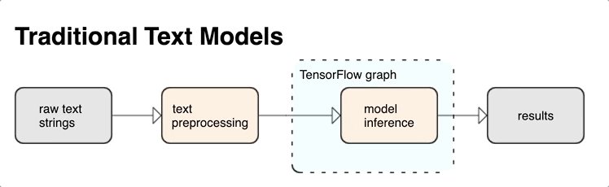

# Tensorflow_text

## Các công cụ xử lý văn bản cho Tensorflow

Tensorflow cung cấp cho bạn một bộ sưu tập đa dạng các hoạt động và thư viện để giúp bạn làm việc với đầu vào ở dạng văn bản như các chuỗi văn bản thô hoặc tài liệu. Những thư viện này có thể thực hiện quá trình tiền xử lý thường xuyên theo yêu cầu của các mô hình dựa trên văn bản, và bao gồm các tính năng hữu ích khác cho mô hình tuần tự.

Bạn có thể trích xuất các đặc trưng văn bản về cú pháp (*syntactic*) và ngữ nghĩa (*semantic*) mạnh mẽ từ bên trong đồ thị Tensorflow làm đầu vào cho mạng thần kinh của bạn.

Tích hợp tiền xử lý với đồ thị TensorFlow cung cấp các lợi ích như sau:

* Tạo điều kiện cho một bộ công cụ lớn làm việc với văn bản.
* Cho phép tích hợp một bộ công cụ Tensorflow lớn để hỗ trợ các dự án từ xác định vấn đề thông qua huấn luyện, đánh giá và khởi chạy.
* Giảm độ phức tạp trong thời gian phục vụ và ngăn chặn sự lệch hướng (*skew*) trong quá trình huấn luyện.

Bên cạnh đó, bạn không cần phải lo lắng về token hoá trong huấn luyện khác với token hoá ở suy luận, hoặc quản lý các kịch bản tiền xử lý.

```python
import tensorflow as tf
import tensorflow_text as tf_text

def preprocess(vocab_table, example_text):

  # Normalize text
  tf_text.normalize_utf8(example_text)

  # Tokenize into words
  word_tokenizer = tf_text.WhitespaceTokenizer()
  tokens = word_tokenizer.tokenize(example_text)

  # Tokenize into subwords
  subword_tokenizer = tf_text.WordpieceTokenizer(
       lookup_table, token_out_type=tf.int64)
  subtokens = subword_tokenizer.tokenize(tokens).merge_dims(1, -1)

  # Apply padding
  padded_inputs = tf_text.pad_model_inputs(subtokens, max_seq_length=16)
  return padded_inputs
```

[Chạy trong sổ tay Colab](https://colab.research.google.com/github/tensorflow/text/blob/master/docs/guide/bert_preprocessing_guide.ipynb)



## Tiền xử lý văn bản

[1. Tiền xử lý từ đầu đến cuối](bert_preprocessing_guide.ipynb)

> Học cách thực hiện tiền xử lý văn bản từ đầu đến cuối bằng BERT

[2. Token hoá từ con](subwords_tokenizer.ipynb)

> Học cách tạo bộ từ vựng từ con từ văn bản

## Phân loại văn bản

[3. Phân loại văn bản với BERT](classify_text_with_bert.ipynb)

> Học cách phân loại văn bản với mô hình BERT

[4. Phân loại văn bản với RNNs](text_classification_rnn.ipynb)

> Phân loại văn bản sử dụng Mạng Thần kinh Hồi quy (*Recurrent Neural Networks*)

## Sinh văn bản

[5. Dịch văn bản với các mô hình Transformer](transformer.ipynb)

> Sử dụng các mô hình Transformer để dịch văn bản

[6. Dịch văn bản với các mô hình seq2seq](nmt_with_attention.ipynb)

> Học cách dịch văn bản với các mô hình sequence-to-sequence
